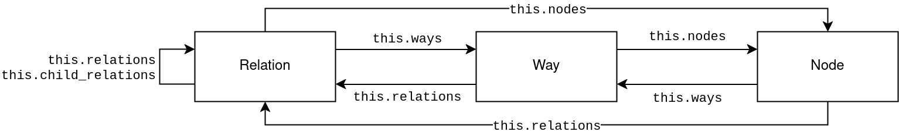

# Simple OSM queries

Simple tool to query OSM data, filter for tags and traverse the hierarchy of the three object types (nodes, ways and relations) of OSM.
This project is still in an early development stage.

## Motivation and Design

##### Why creating a new query tool?
I use Overpass regularly for simple queries but would like to use it for more complex queries as well.
Unfortunately the syntax is rather complicated and for me personally quite unintuitive.
Another reason is, that I cannot host overpass easily on my own system, where easy means "one CLI command".
Therefore, I designed my own query language.

##### Design of the language
I wanted a query language that feels more like programming, which is something I'm used to.

##### Simplicity vs. feature completeness
So far, the language only supports simple queries like "give me all restaurant without phone number".
In the near future queries will be possible that look at the surrounding area of an object, e.g. "give me all waste baskets that are 5m or closer to a bench".
However, tiny edge-cases (i.e. feature not relevant for a large portion of users) will probably not be implemented.

## Usage

1. Import OSM data (in form of a `.osm.pbf` file)
2. Execute queries (via CLI or a simple web-interface)

### Import

Preparations: Add locations to ways and keep untagged nodes with `osmium add-locations-to-ways input-data.osm.pbf -n --overwrite -o data-with-locations.osm.pbf`

Usage: `go run . import data-with-locations.osm.pbf`

Performance comparison (as of 2024-11-01; SSD, 10 year old Intel Xeon E3-1231 v3 and DDR3 RAM):
* The index structure is 5 to 6 times as large as the raw `.osm.pbf` file.
* The import takes longer the more data there is (s. numbers below) but on my machine runs with 1.5 to 2 MB/s.
* Examples
  * The `hamburg-latest.osm.pbf` (~46 MB) takes ~15 s, the cache will be ~390 MB large.
  * The `niedersachsen-latest.osm.pbf` (~675 MB) takes ~6.5 min., the cache will be ~3.8 GB large.
  * The `germany-latest.osm.pbf` (~4.1 GB) takes ~ min., the cache will be  GB large.

### Query

TODO

Performance comparison:
* The query `bbox(1.640,45.489,19.198,57.807).nodes{ amenity=bench AND seats=* }` (whole Germany using `germany-latext.osm.pbf`) takes ~1:35 min. (SSD + 10 year old Intel Xeon E3-1231 v3), which is about the same using Overpass.

### Server

Usage: `go run . server`

This starts an HTTP server on Port 8080. Use [localhost:8080/app](http://localhost:8080/app) to access a simple web-interface.
HTTP POST requests with the query as body go to [localhost:8080/query](http://localhost:8080/query) and return GeoJSON.

## Query language

Queries consist of *statements*, *object types* and *expressions*.

A statement is the high-level structure and consists of several elements:
* A *location expression* defining *where* to search. Example: `bbox(1,2,3,4)`.
* An *object type* defining *what type* to consider. Example: `ways`
* A list of *filter expressions* defining *what tags* to consider. This list might contain sub-statements (s. "Sub-statements" below). Multiple expressions can be combined using logical operators (s. "Operators" below). Example: `highway=*`.

A statement has the following form: `<location-expression>.<object-type>{ <filter-expression> }`.
For example `bbox(1,2,3,4).nodes{ natural=tree }`.

### Output

Only top-level statements, i.e. statements that are not nested within some other statements (s. below), determine the output of the whole query.
Meaning: Any object fulfilling the filter criterion will be part of the output.

### Operators

Filter expressions support the following logical operators:

* `!<expr>`: Negation, usable for e.g. sub-statements (like `!this.ways{...}`).
* `<A> AND <B>`: Conjunction, which means both expressions `A` and `B` must be true so that the overall result of this combined expression is also true.
* `<A> OR <B>`: Disjunction, which means at least one expression `A` or `B` must be true so that the overall result of this combined expression is also true. 

### Sub-statements

Now the tricky part:
Statements can be nested using the `this` specifier, for example: `this.ways{ highway=primary}`.
These statements are called nested statement, inner statement, sub-statement (as used here frequently) or (more technically correct) *context-aware statement*.

Here a bigger example on how this works:
```go
bbox(1, 2, 3, 4).nodes{
    addr:housenumber = * AND
    this.ways{
        building=*
    }
}
```
This query outputs all nodes, which have a house number *and* are part of a building-way (which is often the case for entrance-nodes having a house number).
The `this.ways{...}` statement considers the ways *this* node is part of (therefore the term "context-aware" because the result depends on the current considered node).

### Functions on `this`

Usage: `this.<function-name>`.
No parentheses needed.

| Function name     | Applies to                | Description                                                                                                     |
|:------------------|:--------------------------|:----------------------------------------------------------------------------------------------------------------|
| `nodes`           | Ways and relations        | The list of all nodes being part of the way or relation.                                                        |
| `ways`            | Nodes and relations       | For nodes: The list of all ways the node is part of. For relations: All ways being part of this relation.       |
| `relations`       | Nodes, ways and relations | The list of all relations this node/way/relation is part of. For relations this refers to all parent relations. |
| `child_relations` | Relations                 | Only usable in a context-aware expression to search in child relations of a relation.                           |



### Examples

Find all benches with missing `seats` tag:
```go
// Get all nodes within this bbox, which ...
bbox(1, 2, 3, 4).nodes{
    // ... are a bench without given number of seats
    amenity = bench AND seats!=*
}
```

Find all ways with an address, that have a node on them (e.g. an entrance) that also has an address:
```go
bbox(1, 2, 3, 4).ways{
    addr:housenumber=* AND
    this.nodes{
        addr:housenumber=*
    }
}
```

### Future features (not yet implemented)

Find alls benches near a street/path:
```go
// Get all nodes within this bbox, which ...
bbox(1, 2, 3, 4).nodes{
    // ... are a bench or waste_basket AND ...
    (amenity = bench OR amenity = waste_basket) AND
    // ... have any highway-way within a 5m radius.
    this.buffer(5m).ways{
        highway=*
    }
}
```

Same example but different way-filter using a buffer around the node:

```go
// Get all nodes within this bbox, which ...
bbox(1, 2, 3, 4).nodes{
    // ... are a bench or waste_basket AND ...
    (amenity = bench OR amenity = waste_basket) AND
    // ... all ways in a 5m radius are highway-ways.
    !this.buffer(5m).ways{
        highway!=*
    }
}
```

## Development

See the [README.md](src/README.md) in the `src` folder for further details.